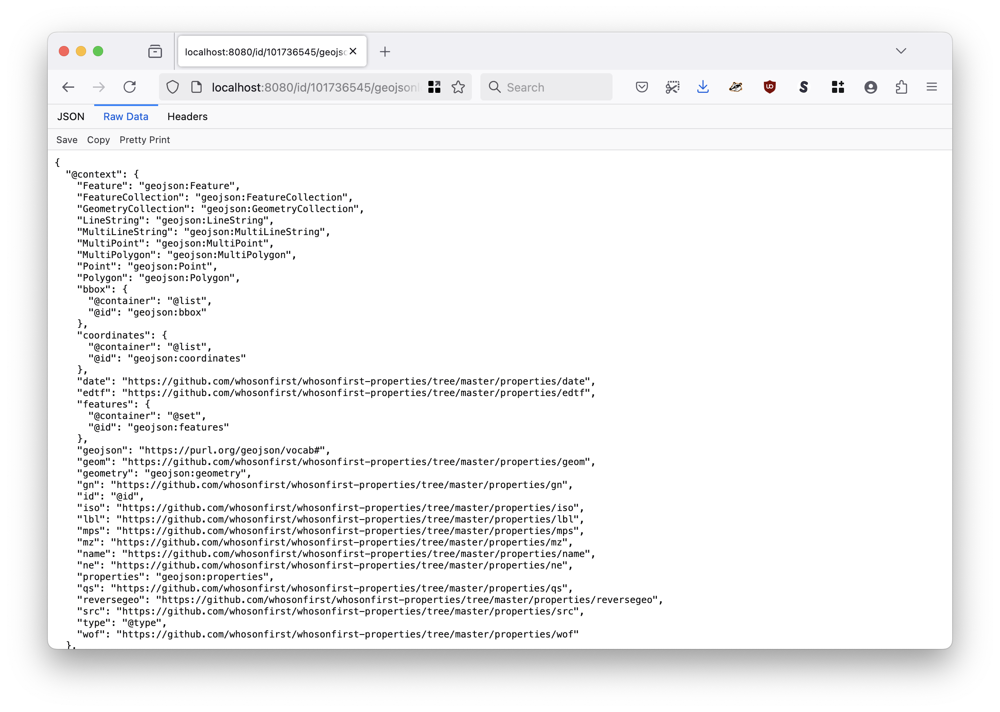
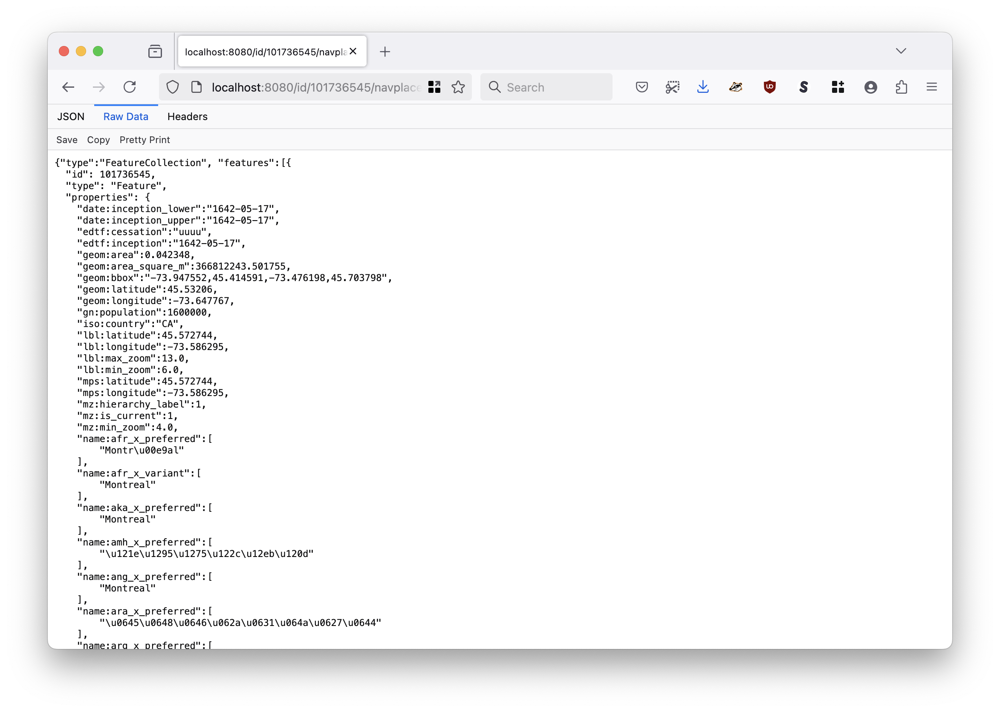
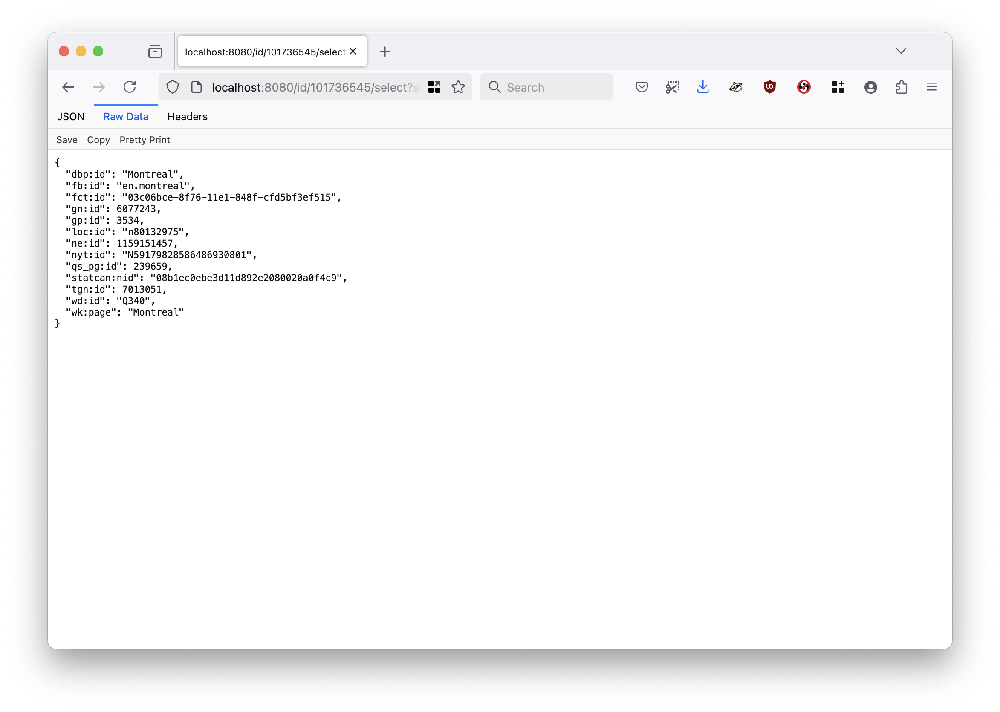
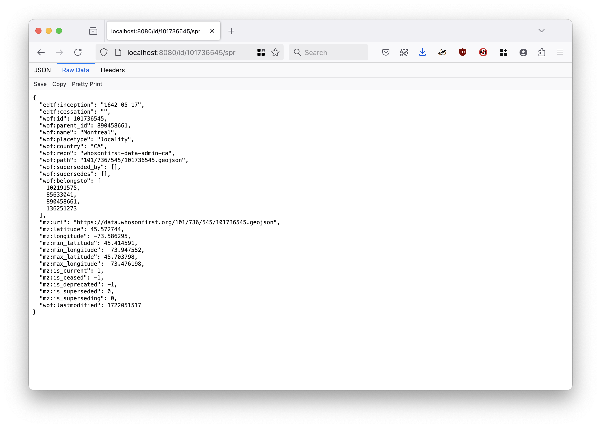
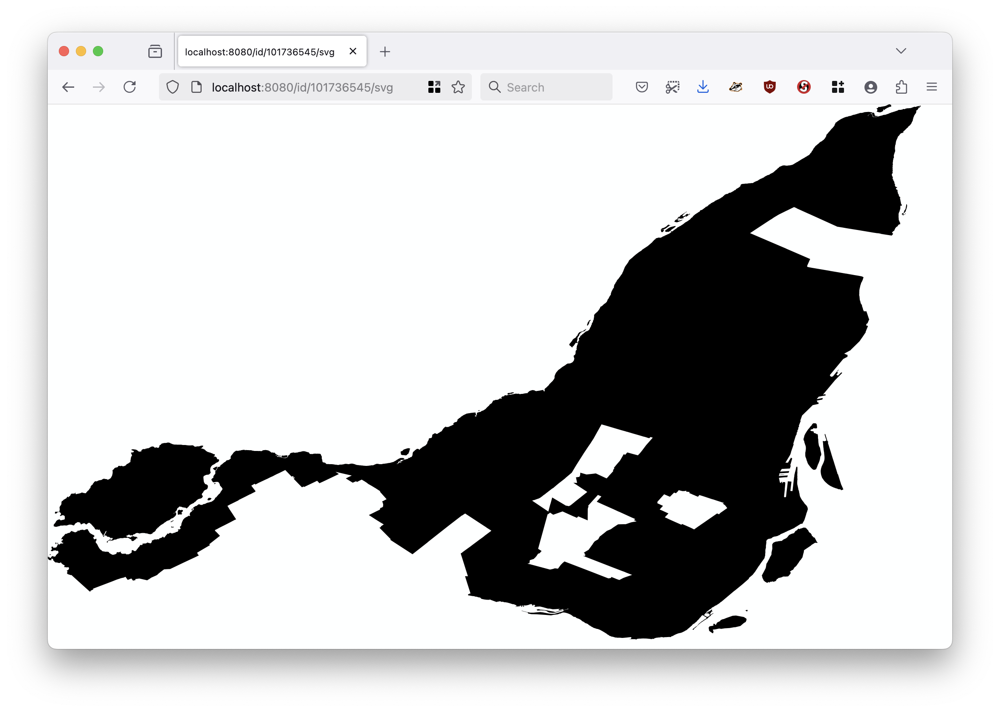

# go-whosonfirst-derivatives

Go package to provide a simple HTTP server-based interface for serving different machine-reabable representations (derivatives) of Who's On First documents.

## Motivation

This is work in progress. It basically the `/api` package extracted from the [whosonfirst/go-whosonfirst-spelunker-httpd](https://github.com/whosonfirst/go-whosonfirst-spelunker-httpd).

It provides a simple HTTP server-based interface for serving different machine-reabable representations (derivatives) of Who's On First documents. The goal, once it's been proven to work, is to import and use the `net/http` handlers provided by this package in `whosonfirst/go-whosonfirst-spelunker-httpd`.

## Documentation

This is work in progress. Documentation is incomplete at this time.

## Tools

```
$> make cli
go build -mod vendor -ldflags="-s -w" -o bin/server cmd/server/main.go
```

### server

A simple HTTP server-based interface for serving different machine-reabable representations (derivatives) of Who's On First documents.

```
$> ./bin/server -h
A simple HTTP server-based interface for serving different machine-reabable representations (derivatives) of Who's On First documents.

Usage:
	 ./bin/server[options]

Valid options are:
  -authenticator-uri string
    	A registered sfomuseum/go-auth.Authenticator URI. (default "null://")
  -path-geojson string
    	The default path to serve GeoJSON requests from. (default "/id/{id}/geojson")
  -path-geojson-alt value
    	Zero or more alternate paths to serve GeoJSON requests from.
  -path-geojsonld string
    	The default path to serve GeoJSONLD requests from. (default "/id/{id}/geojsonld")
  -path-geojsonld-alt value
    	Zero or more alternate paths to serve GeoJSONLD requests from.
  -path-navaplace-alt value
    	Zero or more alternate paths to serve IIIF NavPlace requests from.
  -path-navplace string
    	The default path to serve IIIF NavPlace requests from. (default "/id/{id}/navplace")
  -path-select string
    	The default path to serve select requests from. (default "/id/{id}/select")
  -path-select-alt value
    	Zero or more alternate paths to serve select requests from.
  -path-spr string
    	The default path to serve standard place result (SPR) requests from. (default "/id/{id}/spr")
  -path-spr-alt value
    	Zero or more alternate paths to serve standard place result (SPR) requests from.
  -path-svg string
    	The default path to serve SVG requests from. (default "/id/{id}/svg")
  -path-svg-alt value
    	Zero or more alternate paths to serve SVG requests from.
  -provider-uri string
    	A registered whosonfirst/go-whosonfirst-derivatives.Provider URI. (default "reader://?reader-uri=https://data.whosonfirst.org")
  -server-uri string
    	A registered aaronland/go-http-server.Server URI. (default "http://localhost:8080")
  -verbose
    	Enable verbose (debug) logging.
```

#### Example

```
$> make debug
go run -mod vendor cmd/server/main.go \
		-verbose
2025/04/02 11:45:18 DEBUG Verbose logging enabled
2025/04/02 11:45:18 INFO Listening for requests address=http://localhost:8080
2025/04/02 11:45:18 DEBUG Enable handler uri=/id/{id}/geojsonld handler=handler.RouteHandlerFunc
2025/04/02 11:45:18 DEBUG Enable handler uri=/id/{id}/navplace handler=handler.RouteHandlerFunc
2025/04/02 11:45:18 DEBUG Enable handler uri=/id/{id}/select handler=handler.RouteHandlerFunc
2025/04/02 11:45:18 DEBUG Enable handler uri=/id/{id}/spr handler=handler.RouteHandlerFunc
2025/04/02 11:45:18 DEBUG Enable handler uri=/id/{id}/svg handler=handler.RouteHandlerFunc
2025/04/02 11:45:18 DEBUG Enable handler uri=/id/{id}/geojson handler=handler.RouteHandlerFunc
```

And then in another terminal:

```
$> curl 'http://localhost:8080/id/101736545/select?select=properties.wof:name'
"Montreal"
```

#### Providers

##### null://

##### reader://

#### Representations (derivative formats)

##### GeoJSON

Returns the original Who's On First (WOF) GeoJSON document. For example `http://localhost:8080/id/101736545/geojson` would yield:


##### GeoJSONLD

Returns a Who's On First (WOF) document as a [GeoJSONLD](#) document. For example `http://localhost:8080/id/101736545/geojsonld` would yield:



##### NavPlace

Returns a WOF record as a GeoJSON `FeatureCollection` document. This enables WOF records to be included in [IIIF navPlace](https://preview.iiif.io/api/navplace_extension/api/extension/navplace/) records as "reference" objects. For example `http://localhost:8080/id/101736545/navplace` would yield:



You can specify multiple `Feature` records to include in a response by passing a comma-separated list of IDs. For example:

`http://localhost:8080/id/102527513,85922583,85688637/navplace`

_Note: There is a limit on the number of records that may be specified which is set by the `-navplace-max-features` flag._

##### Select

A JSON-encoded slice of a Who's On First (WOF) GeoJSON document matching a query pattern. For example `http://localhost:8080/id/101736545/select?select=properties.wof:concordances` would yield:



`select` parameters should conform to the [GJSON path syntax](https://github.com/tidwall/gjson/blob/master/SYNTAX.md).

As of this writing multiple `select` parameters are not supported. `select` parameters that do not match the regular expression defined in the `-select-pattern` flag (at startup) will trigger an error.

##### Standard Places Result (SPR)

A JSON-encoded "standard places response" for a given WOF ID. For example `http://localhost:8080/id/101736545/spr` would yield:



##### SVG

An XML-encoded SVG representation of the geometry for a given WOF ID. For example `http://localhost:8080/id/101736545/svg` would yield:



## See also

* https://github.com/whosonfirst/go-whosonfirst-spr
* https://github.com/whosonfirst/go-whosonfirst-svg
* https://github.com/sfomuseum/go-geojsonld
* https://github.com/aaronland/go-http-server
* https://github.com/sfomuseum/go-http-auth